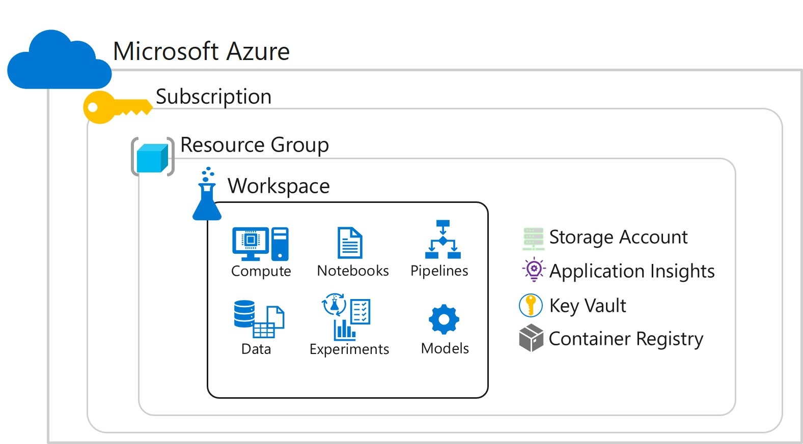

# [Azure Workspace](https://learn.microsoft.com/en-us/training/modules/intro-to-azure-machine-learning-service/2-azure-ml-workspace)



## [Creating a Workspace](https://microsoftlearning.github.io/mslearn-dp100/instructions/01-create-a-workspace.html)

` git clone https://github.com/MicrosoftLearning/mslearn-dp100 mslearn-dp100`

- You can create a workspace in any of the following ways:

1. In the Microsoft Azure portal, create a new Machine Learning resource, specifying the subscription, resource group and workspace name.

1. Use the Azure Machine Learning Python SDK to run code that creates a workspace. For example, the following code creates a workspace named aml-workspace (assuming the Azure ML SDK for Python is installed and a valid subscription ID is specified):

`pip install azureml-sdk azureml-widgets` widgets provides support for interactive widgets in a Jupyter notebook environment

```python

```

### Create
```python
from azureml.core import Workspace
    
    ws = Workspace.create(name='aml-workspace', 
                      subscription_id='123456-abc-123...',
                      resource_group='aml-resources',
                      create_resource_group=True,
                      location='eastus'
                     )
```

## Acessing Azure Machine Learning workspace
In the Azure portal blade for your Azure Machine Learning workspace, click the link to launch studio; or alternatively, in a new browser tab, open https://ml.azure.com. If prompted, sign in using the Microsoft account you used in the previous task and select your Azure subscription and workspace.

